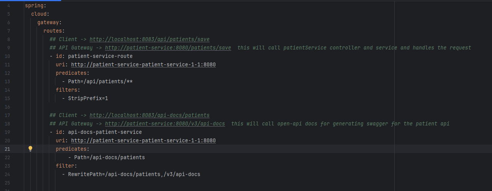

Routed Auth request(/login and /validate via API Gateway)

Fails to load patient with Auth token

With Auth token handled via JWTValidationGatewayFilterFactory

Auth Service API Docs via api-gateway

